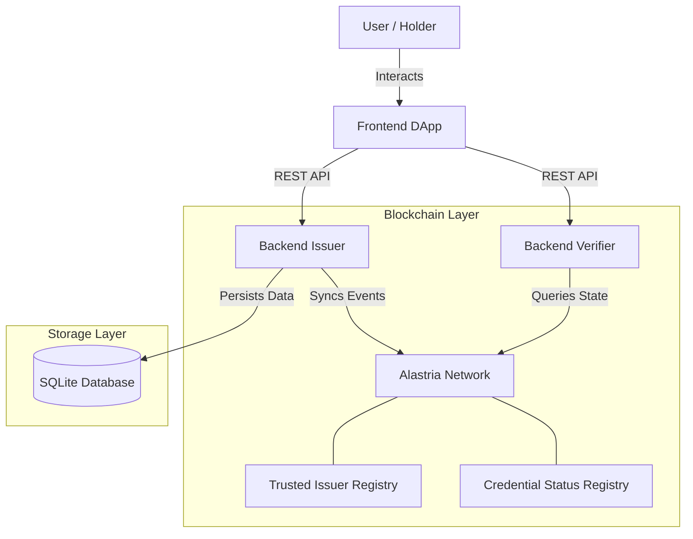
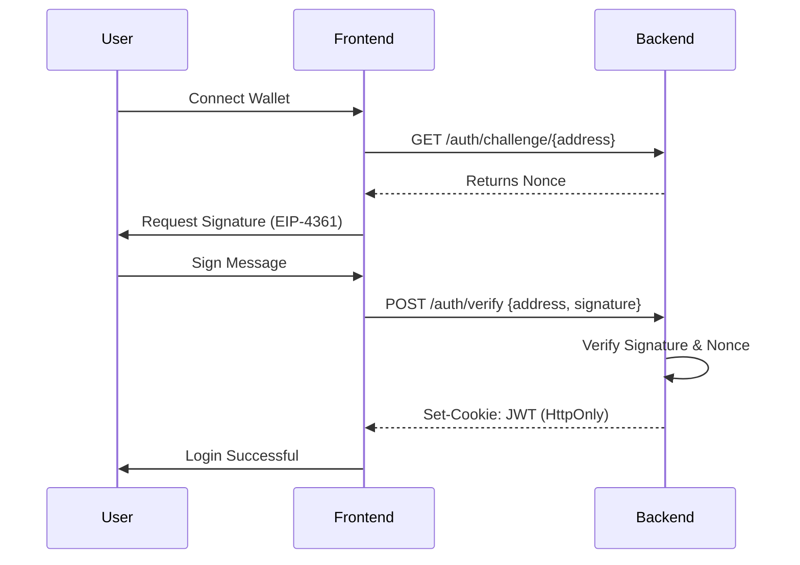
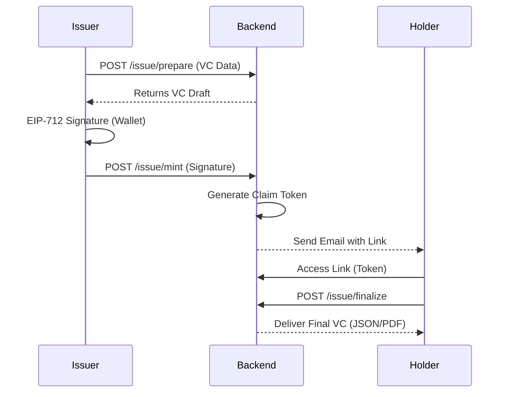

# Alastria VC/VP Platform

Comprehensive platform for issuing, managing, and verifying Verifiable Credentials (VCs) and Verifiable Presentations (VPs) in the Alastria ecosystem. This project implements W3C standards and Ethereum EIPs to ensure Self-Sovereign Identity (SSI).

## Table of Contents
1. [Project Architecture](#project-architecture)
2. [Functional Design](#functional-design)
3. [System Components](#system-components)
4. [PDF Metadata Standard](#pdf-metadata-standard)
5. [Key Technologies](#key-technologies)
6. [Configuration and Deployment](#configuration-and-deployment)

---

## Project Architecture

The project is a **Monorepo** managed with `pnpm` and `turbo`, organized to maximize code reuse and type consistency.

---

## Functional Design

### System Architecture



### Authentication Flow (SIWA)

The system uses "Sign-In With Alastria" (based on SIWE) to authenticate users through their wallet, without requiring passwords.



### Credential Issuance Flow



---

## System Components

### 1. Backend Issuer
Responsible for business logic related to credential issuance.
- **REST API**: Endpoints to prepare, sign, and finalize issuances.
- **Identity Management**: Implements SIWA for authentication.
- **PDF Generation**: Creates visual representations of VCs with embedded metadata.

### 2. Backend Verifier
Service dedicated to cryptographic and state validation.
- **Off-chain Verification**: Validates EIP-712 signatures and W3C structure.
- **On-chain Verification**: Queries revocation and validity status in Smart Contracts.

### 3. Frontend (DApp)
Unified user interface for Holders, Issuers, and Administrators.
- **Roles**: Admin, Issuer, Holder.
- **Wallet**: Deep integration with MetaMask and Snaps for secure storage.

### 4. Smart Contracts
On-chain infrastructure for trust and state management.
- **Trusted Issuer Registry**: Registry of authorized issuers.
- **Revocation Registry**: Credential validity status.

---

## PDF Metadata Standard

Credentials generated by the platform are self-contained PDF documents that act as secure carriers of verifiable information.

### Metadata Structure
The complete JSON file of the Verifiable Credential (VC) is embedded within the PDF file using the XMP metadata standard, specifically in the `Subject` field.

- **Subject**: Contains the complete VC in JSON format, encoded in **Base64**. This allows any verifier to extract the original credential without relying on the visual content of the PDF, which could be altered.
- **Title**: "Verifiable Credential - Circuloos"
- **Author**: "Circuloos - Alastria Consortium"
- **Keywords**: "Verifiable Credential", "W3C", "Alastria", "Circuloos", "Blockchain"

### Verification
The PDF verification process involves:
1. Extracting the `Subject` field from the PDF metadata.
2. Decoding the Base64 content to obtain the VC JSON.
3. Cryptographically validating the EIP-712 signature of the extracted JSON.
4. Verifying the credential status on the blockchain (revocation, trusted issuer).

---

## Key Technologies

### EIP-712 (Typed Structured Data Hashing and Signing)
The core of security and user experience. Allows users to sign structured, readable data instead of opaque hexadecimal hashes.
- **Domain**: Defines the context (`name`, `version`, `chainId`, `verifyingContract`).
- **Types**: Strict definitions for `Credential`, `Presentation`, `Claim`, etc.
- **Implementation**: Centralized in `packages/common/src/eip712`, ensuring frontend, backend, and contracts use the same schemas.

### Diamond Pattern (EIP-2535)
Modular and upgradeable smart contract architecture.
- **Facets**: Small logic contracts (`AttestationBatch`, `CredentialStatus`, `TrustedIssuer`) that connect to a central proxy (Diamond).
- **Advantage**: Allows overcoming contract size limits and updating functionality without changing the main contract address.

---

## Configuration and Deployment

### Prerequisites
- Node.js 20+
- PNPM (`npm i -g pnpm`)
- Docker & Docker Compose

### Environment Variables
The system uses a master `.env` file.
1. Copy the example: `cp .env-sample .env`
2. Configure critical variables:
   - `RPC_URL`: Alastria network endpoint (or local).
   - `DEPLOYER_PRIVATE_KEY`: Account for deployments.
   - `JWT_SECRET`: Session security.

### Start the Environment
```bash
# Install dependencies
pnpm install

# Start local development environment (with Hardhat node)
pnpm dev:local

# Start with Docker (containerized services)
pnpm dev:docker

## Windows Deployment Guide

### Prerequisites
- Docker Desktop for Windows
- Node.js 20+
- npm (comes with Node.js)

### First Time Setup

1. **Install pnpm globally** (if not already installed):
```powershell
npm install -g pnpm@9.15.4
```

2. **Install dependencies**:
```powershell
pnpm install
```

3. **Build and start all services**:
```powershell
docker compose up -d --build
```

### Managing the Project

**Stop all services**:
```powershell
docker compose down
```

**Restart services** (without rebuilding):
```powershell
docker compose up -d
```

**View logs**:
```powershell
docker compose logs -f
```

**View specific service logs**:
```powershell
docker compose logs -f web
docker compose logs -f issuer
docker compose logs -f verifier
```

**Check service status**:
```powershell
docker compose ps
```

### Available Services and Routes

Once running, the following services are available:

| Service | URL | Description |
|---------|-----|-------------|
| **Web Frontend** | http://localhost:3000 | Main user interface |
| **Issuer API** | http://localhost:3001 | Credential issuance API |
| **Verifier API** | http://localhost:3002 | Credential verification API |
| **Hardhat Node** | http://localhost:8545 | Local blockchain RPC |
| **Mailpit** | http://localhost:8025 | Email testing interface |

### API Routes

**Issuer API** (`http://localhost:3001`):
- `GET /health` - Health check
- `POST /api/credentials/issue` - Issue a credential
- `GET /api/credentials/:id` - Get credential details

**Verifier API** (`http://localhost:3002`):
- `GET /health` - Health check
- `POST /api/presentations/verify` - Verify a presentation
- `GET /api/presentations/:id` - Get presentation details

### Troubleshooting

**If build fails**, clean Docker cache and rebuild:
```powershell
docker compose down -v
docker system prune -a -f
docker builder prune -a -f
docker compose up -d --build
```

**If pnpm-lock.yaml issues**, regenerate it:
```powershell
Remove-Item pnpm-lock.yaml
pnpm install
```

### Technical Notes

- All Dockerfiles use `NODE_ENV=development` to ensure devDependencies (TypeScript, etc.) are installed
- Workspace packages use `workspace:*` protocol for proper pnpm monorepo resolution
- Build time: ~3-4 minutes for all services on first build
- Subsequent builds are faster due to Docker layer caching

